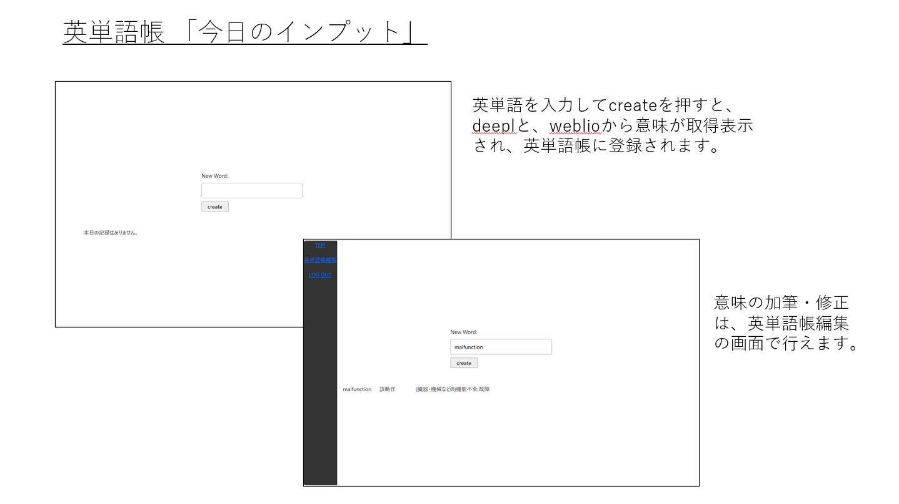

# 「エビングハウスの英単語帳＆メモ帳」

 [エビングハウスの忘却却曲線](https://ja.wikipedia.org/wiki/%E5%BF%98%E5%8D%B4%E6%9B%B2%E7%B7%9A)を参考にして、最適と思われるタイミング（１日後、７日後、２８日後）で、勉強内容を復習できるようにした英単語帳・メモ帳アプリ。   
  
  
### 作成の動機
- webエンジニアリングのような分野で多岐にわたる学習をしていると、しばらくご無沙汰の分野が生じて記憶が曖昧になりがち。一定間隔を置いて復習できるメモ帳が欲しい。
- 英語が苦手な息子の大学受験への活用（⇒単語イメージの画像化など機能拡充中）。   
- webエンジニアリングのような分野で多岐にわたる学習をしていると、しばらくご無沙汰の分野が生じて記憶が曖昧になりがち。一定間隔を置いて復習できるメモ帳が欲しい。
- 英語が苦手な息子の大学受験への活用（⇒単語イメージの画像化など機能拡充中）。   
  
### チュートリアル
1.ログイン後 ＴＯＰ画面
     
  
2.英単語　インプット画面（今日のインプット）
     
  
3.英単語帳　復習・ドリル画面
     
  
（メモ帳については、英単語帳のマイナーチェンジなので省略します）     

### 使用技術
  バックエンド：Python,Django,MySQL,RestframeWork  
  フロントエンド：React,javascript,html,css  
  サーバ：heroku  
  バージョン管理：git (version 2.34.1)  
  動作環境：Python 3.10.12  
           Node.js v20.17.0  
           npm 10.8.2  
  開発環境: VSCode, WSL2(ubuntu:22.04)  
 

### セットアップ  
### 1.バックエンド:MySQL,python,Django  
#### (1)MySQL(ubuntuの場合)  
・システムパッケージの最新化  
sudo apt update  
sudo apt upgrade -y  
・MySQLサーバのインストール  
sudo apt install mysql-server -y  
（確認作業：sudo systemctl status mysqlでActivateの表示を確認）  
・セキュリティ設定（指示に従ってパスワード設定等）  
sudo mysql_secure_installation  
・MySQLへのログイン  
sudo mysql -u root -p  

・新しいデータベースを作成  
CREATE DATABASE my_database(任意);  
・新しいユーザ、パスワード設定  
CREATE USER 'my_user(任意)'@'localhost（任意？）' IDENTIFIED BY 'my_password（任意）';   
・上記ユーザに権限付与  
GRANT ALL PRIVILEGES ON my_database.* TO 'my_user(任意)'@'localhost(任意？)';  
FLUSH PRIVILEGES;  
・終了（exit）  
こちらで設定した、４つのパラメータは後述の.envファイル設定に適用する。  
 
- DB_NAME=my_database（任意） 
- DB_USER=my_user（任意） 
- DB_PASSWORD=my_password（任意）  
- DB_HOST=localhost（任意？） 
   

#### (2)Python,djangoの設定 
・Python 3.10.12をインストールする。   
・下記のgit cloneコマンドで、バックエンドソースコードを取得。  
git clone https://github.com/goemon024/ebing_house.git   
ブランチは、masterを利用。 
・pythonの仮想環境を有効化。 
  python -m venv venv 
  source venv/bin/activate  
・pip install -r requirements.txt 
・.envファイルを作成する。  
  詳細は、.env.exampleを参照のこと。   
・データベースのmigration 
  python manage.py migrate 
  （・必要に応じてsuperuserの作成）   
  python manage.py createsuperuser   
 

### ２．フロントエンド：react  
・node.jsのインストール（2024年10月時点のLTS）  
  curl -fsSL https://deb.nodesource.com/setup_18.x | sudo -E bash - 
  sudo apt-get install -y nodejs  
・reactをインストールするフォルダを作成してgit cloneします。下記のgit cloneコマンドで、フロントエンドソースコードを取得。   
  mkdir front 
  cd front  
  git clone https://github.com/goemon024/front.git 
  ブランチは、mainを利用。  
・frontのディレクトリで、npm install 
・.env.exampleファイルは原則不要です。ただし本番環境のためのnpm run buidl-deployを実行する場合には、build-deploy.shに環境変数の入力が必要となります。このときは、build-deploy.shに、DJANGO_MANAGE_DIRと、PYENV_ACTIVATEを入力してください。   
・（開発環境）npm start 
・（本番環境）npm run build-deploy   
  build-deploy.shは、backendへのデプロイ処理を効率化するバッチです。上記のコマンドを入力することで、frontで構築されたbuildファイル群が、backendのstatic/reactフォルダ下に配置され,staticfilesフォルダも更新されます。 
 

### 開発環境と本番環境について 
・開発環境にするときは、backendのconfig/urls.pyの53行目のコメントアウトを解除し、47～49行目をコメントアウトしてください。これによりローカルにおいて、frontがlocalhost:3000に、backendがlocalhost:8000に立ち上がります。 
・本番環境にするときは、backendのconfig/urls.pyの47～49行目のコメントアウトを解除し、53行目をコメントアウトしてください。これによりfront部分がbackendと共通ドメインのlocalhost:8000に包含されるようになります。 
  

### その他 
#### １．本番環境のherokuサーバでは下記のバッチファイルがスケジュール実行されます。   
・batch/batch_backup.py 
  ＤＢのバックアップファイルを形成。   
・batch_guestdata_generate1.py, batch_guestdata_generate2.py  
 　これらはデモンストレーションのため、アクティブなユーザの使用状況をguestIDで確認できるようにするためのものです。利用する場合には、BATCH_CHECK_TABLE1 = 'wlist_wordsmodel'
BATCH_CHECK_TABLE2 = 'wlist_memomodel'というように環境変数を設定してください。 
#### ２．OpenAIのAPIによる画像生成について  
・batch_openAI.py,temp_mysql_update.py 
 現状ではopenAIによる英単語の画像生成は、息子のアカウントのみの適用としています。コスト面などからの試験的運用で、上記２つのバッチファイルを手動実行させて画像生成をしています。 
#### ３．携帯での英単語・メモ帳の編集画面表示について   
・表示レコード数が多い場合に、モーダルが開かずに強制終了する不具合があります（今回は対応しないため説明のみ）。 
#### ４．編集モーダルのフォーマット入力時の文字の透明化について   
・おそらく表示レコード数が多いことに起因して、フォーマット入力時に文字が透明化してしまう不具合が発生しています。 
# ebing_house_docker
